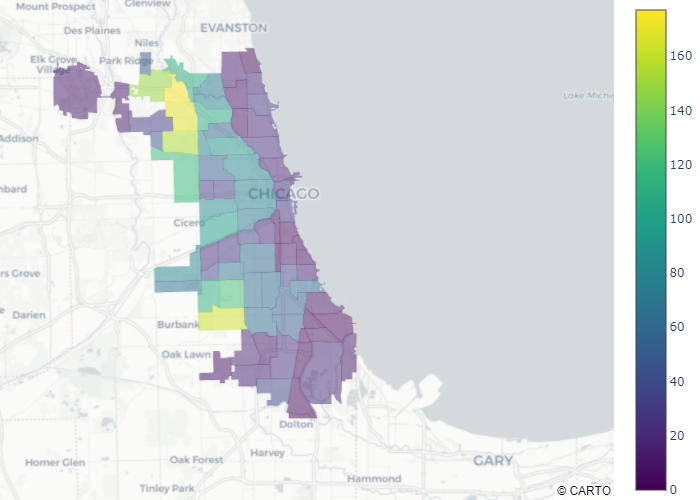
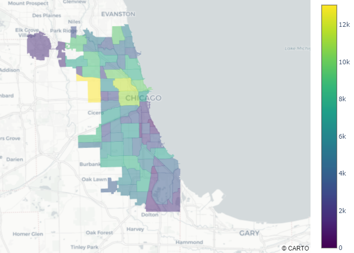

# Chicago Pothole Reports

*Cloropleth Map of Chicago Neighborhoods based on number of potholes reported.*

### Open Reports of Potholes as of 10/26/2019

This can show the distribution of infrastructure care by the city of Chicago in each community area. West Side Chicago seems to have the majority of reports of potholes to 311 which are open as of this posting.

### Completed Reports of Potholes as of 10/26/2019

An attempt to see if completed cases showed any pattern in the Chicago communities but as it's more spread out, there seems to be little correlation.